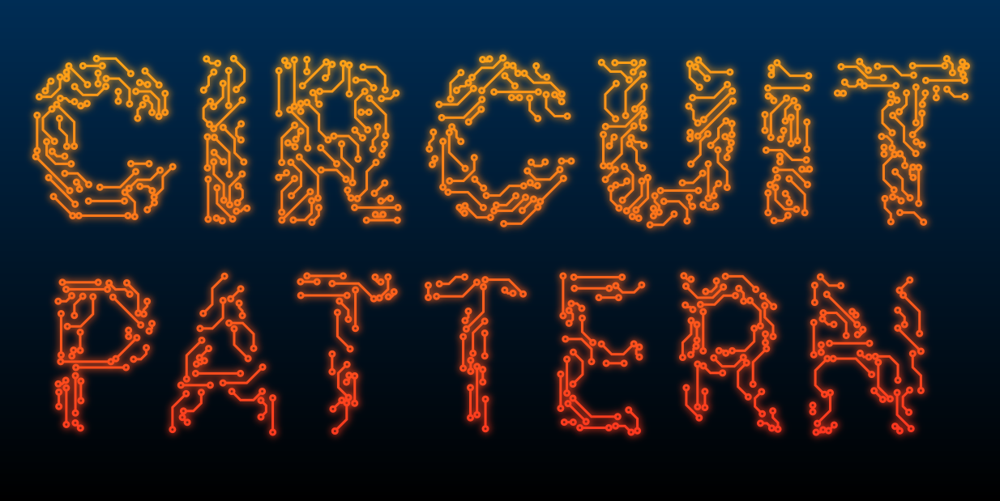

# Circuit Board Pattern Generator

**[🌐 Try it online](https://hacod-tech.github.io/Circuit-Board-Pattern-Generator/)**

A web-based application for generating SVG circuit board patterns. Create intricate circuit board designs with customizable lines and circles that can be applied to various shapes including freehand drawings, text, ellipses, and rectangles.

## Features

### Pattern Generation
- **45-degree angle lines** with circles at endpoints
- **Collision detection** to prevent overlapping lines
- **Progressive placement** algorithm (longest lines first)
- **Configurable parameters**:
  - Pattern density
  - Line thickness
  - Circle radius
  - Min/max line length
  - Pattern scale
  - Line color and gradients (linear/radial)

### Object Types
- **Freehand Drawing**: Draw custom shapes with your mouse
- **Text**: Add editable text with custom fonts, weights, stroke, and letter spacing
- **Ellipse**: Create circular or elliptical shapes
- **Rectangle**: Add rectangular shapes

### Text Features
- Multiple font families (Inter, Arial, Monaco, Consolas, Menlo, and more)
- Adjustable font weight (100-900)
- Custom stroke width
- Letter spacing control
- Resizable and movable text objects

### Gradient Support
- **Linear gradients**: Customizable start and end points
- **Radial gradients**: Centered or custom positioned
- **Interactive editing**: Drag and drop gradient points on canvas
- **Visual handles**: See gradient direction with interactive controls

### Export
- Download patterns as SVG files
- Preserves gradients and all styling
- Transparent or colored backgrounds

## Usage

1. **Add Objects**: Click on the object type buttons in the left sidebar (Freehand, Text, Ellipse, or Rectangle)
2. **Draw/Edit**:
   - For freehand: Click and drag on the canvas
   - For text: Click "Edit" to modify content, font, weight, stroke, and letter spacing
   - For shapes: Click and drag to create
3. **Customize Pattern**: Adjust pattern parameters in the controls panel
4. **Generate**: Click "Generate Pattern" to fill your objects with the circuit board pattern
5. **Export**: Click "Download SVG" to save your design

### Text Editing
- Click the "Edit" button on a text object to open the editor
- Modify text content, font family, weight, stroke width, and letter spacing
- Resize text by dragging the corner handles
- Move text by dragging the text itself

### Gradient Editing
1. Select a gradient type (Linear or Radial)
2. Check "Edit Gradient Points on Canvas"
3. Drag the colored handles to adjust gradient direction/position
4. The pattern updates in real-time

## Technical Details

### Pattern Algorithm
- Uses a rasterized mask approach for accurate pattern generation within complex shapes
- Progressive line placement: longest lines first, then shorter ones
- Collision detection ensures proper spacing for circles and line thickness
- Supports scaling for different pattern densities

### Technologies
- Pure JavaScript (ES6+)
- SVG for rendering
- HTML5 Canvas for mask generation
- CSS3 for styling

## Browser Support

Works in all modern browsers that support:
- SVG
- HTML5 Canvas
- ES6 JavaScript features

## License
GNU GPL v3

Made by [Hacod](https://hacod.tech/)

